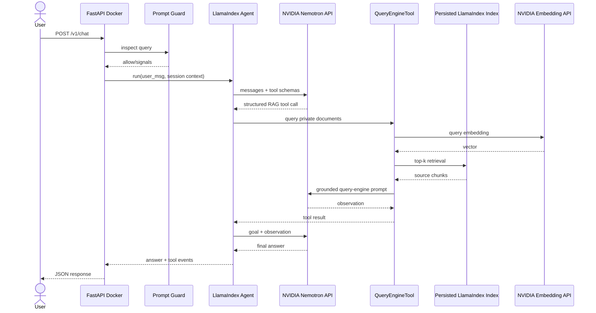

# Sequence diagram

Rendered SVG: [chat-sequence.svg](diagrams/chat-sequence.svg)

```mermaid
sequenceDiagram
  actor User
  participant API as FastAPI Docker
  participant Guard as Prompt Guard
  participant Agent as LlamaIndex Agent
  participant LLM as NVIDIA Nemotron API
  participant RAG as QueryEngineTool
  participant Index as Persisted LlamaIndex Index
  participant Embed as NVIDIA Embedding API

  User->>API: POST /v1/chat
  API->>Guard: inspect query
  Guard-->>API: allow/signals
  API->>Agent: run(user_msg, session context)
  Agent->>LLM: messages + tool schemas
  LLM-->>Agent: structured RAG tool call
  Agent->>RAG: query private documents
  RAG->>Embed: query embedding
  Embed-->>RAG: vector
  RAG->>Index: top-k retrieval
  Index-->>RAG: source chunks
  RAG->>LLM: grounded query-engine prompt
  LLM-->>RAG: observation
  RAG-->>Agent: tool result
  Agent->>LLM: goal + observation
  LLM-->>Agent: final answer
  Agent-->>API: answer + tool events
  API-->>User: JSON response
```
